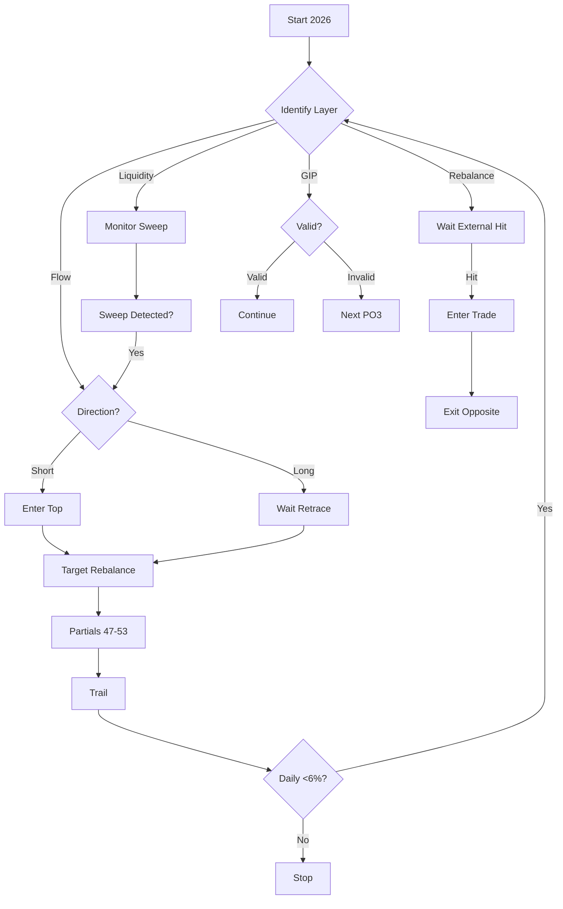

# Flowchart Diagram

```mermaid
graph TD
A[Start 2026] --> B{Identify Layer}
B -->|Liquidity| C[Monitor Sweep]
B -->|Flow| D{Direction?}
B -->|Rebalance| E[Wait External Hit]
B -->|GIP| F{Valid?}
C --> G[Sweep Detected?]
G -->|Yes| D
D -->|Short| H[Enter Top]
D -->|Long| I[Wait Retrace]
E -->|Hit| J[Enter Trade]
F -->|Valid| K[Continue]
F -->|Invalid| L[Next PO3]
H --> M[Target Rebalance]
I --> M
J --> N[Exit Opposite]
M --> O[Partials 47-53]
O --> P[Trail]
P --> Q{Daily <6%?}
Q -->|Yes| B
Q -->|No| R[Stop]
```
