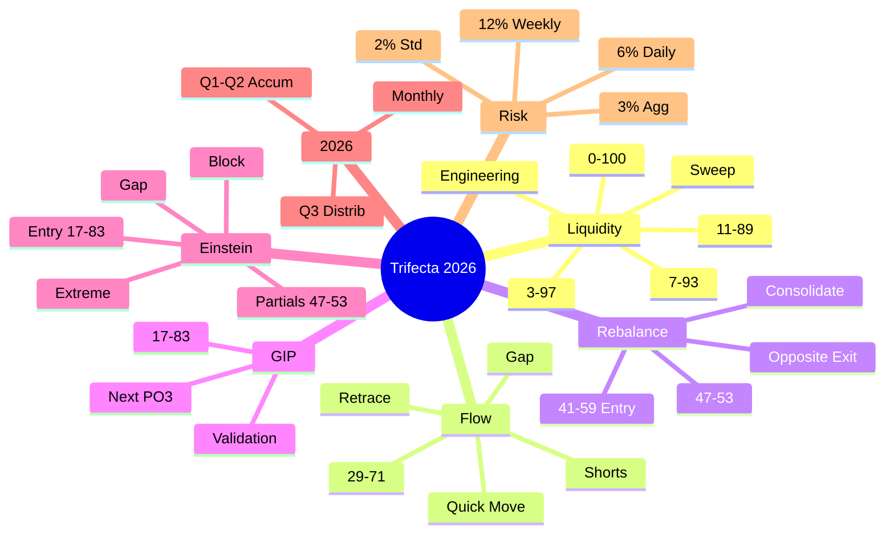

# Mindmap Diagram

```mermaid
mindmap
  root((Trifecta 2026))
    Liquidity
      Engineering
      Sweep
      11-89
      3-97
      0-100
      7-93
    Flow
      29-71
      Quick Move
      Shorts
      Gap
      Retrace
    Rebalance
      47-53
      Consolidate
      41-59 Entry
      Opposite Exit
    GIP
      17-83
      Validation
      Next PO3
    Einstein
      Extreme
      Block
      Gap
      Entry 17-83
      Partials 47-53
    2026
      Q1-Q2 Accum
      Q3 Distrib
      Monthly
    Risk
      2% Std
      3% Agg
      6% Daily
      12% Weekly
```
