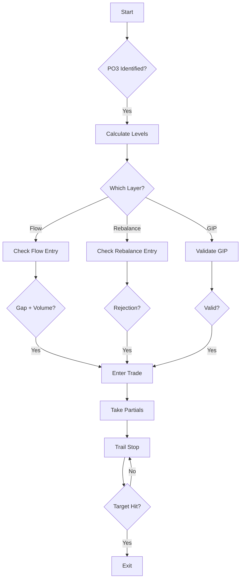

# Flowchart Diagram

```mermaid
graph TD
A[Start] --> B{PO3 Identified?}
B -->|Yes| C[Calculate Levels]
C --> D{Which Layer?}
D -->|Flow| E[Check Flow Entry]
D -->|Rebalance| F[Check Rebalance Entry]
D -->|GIP| G[Validate GIP]
E --> H{Gap + Volume?}
F --> I{Rejection?}
G --> J{Valid?}
H -->|Yes| K[Enter Trade]
I -->|Yes| K
J -->|Yes| K
K --> L[Take Partials]
L --> M[Trail Stop]
M --> N{Target Hit?}
N -->|Yes| O[Exit]
N -->|No| M
```
