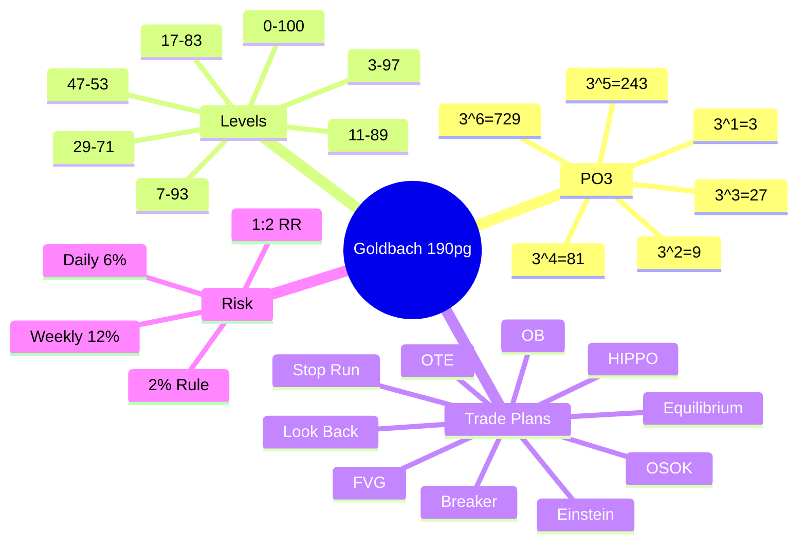

# Mindmap Diagram

```mermaid
mindmap
  root((Goldbach 190pg))
    PO3
      3^1=3
      3^2=9
      3^3=27
      3^4=81
      3^5=243
      3^6=729
    Levels
      0-100
      3-97
      7-93
      11-89
      17-83
      29-71
      47-53
    Trade Plans
      Look Back
      HIPPO
      OSOK
      OTE
      OB
      Breaker
      Stop Run
      Equilibrium
      FVG
      Einstein
    Risk
      2% Rule
      1:2 RR
      Daily 6%
      Weekly 12%
```
