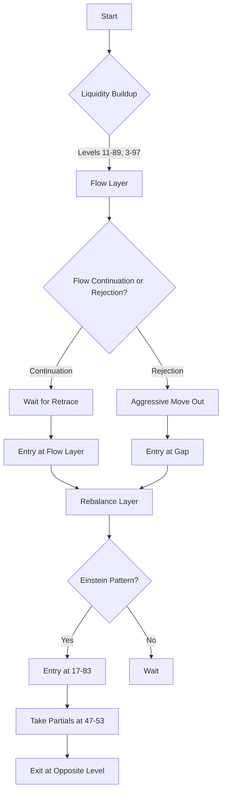

# Flowchart Diagram

```mermaid

graph TD
    A[Start] --> B{Liquidity Buildup}
    B -->|Levels 11-89, 3-97| C[Flow Layer]
    C --> D{Flow Continuation or Rejection?}
    D -->|Continuation| E[Wait for Retrace]
    D -->|Rejection| F[Aggressive Move Out]
    E --> G[Entry at Flow Layer]
    F --> H[Entry at Gap]
    G --> I[Rebalance Layer]
    H --> I
    I --> J{Einstein Pattern?}
    J -->|Yes| K[Entry at 17-83]
    J -->|No| L[Wait]
    K --> M[Take Partials at 47-53]
    M --> N[Exit at Opposite Level]
    
```
