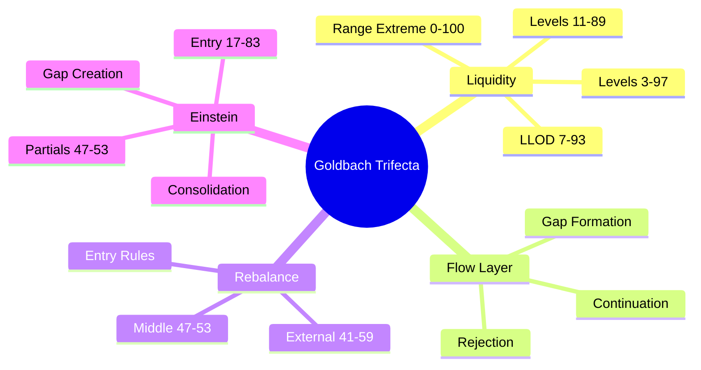

# Mindmap Diagram

```mermaid

mindmap
  root((Goldbach Trifecta))
    Liquidity
      Levels 11-89
      Levels 3-97
      Range Extreme 0-100
      LLOD 7-93
    Flow Layer
      Continuation
      Rejection
      Gap Formation
    Rebalance
      Middle 47-53
      External 41-59
      Entry Rules
    Einstein
      Consolidation
      Gap Creation
      Entry 17-83
      Partials 47-53
    
```
