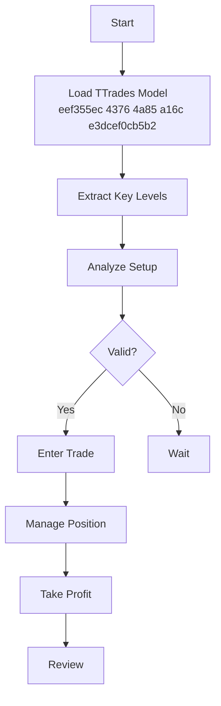

# Flowchart Diagram

```mermaid
graph TD
A[Start] --> B[Load TTrades Model   eef355ec 4376 4a85 a16c e3dcef0cb5b2]
B --> C[Extract Key Levels]
C --> D[Analyze Setup]
D --> E{Valid?}
E -->|Yes| F[Enter Trade]
E -->|No| G[Wait]
F --> H[Manage Position]
H --> I[Take Profit]
I --> J[Review]
```
