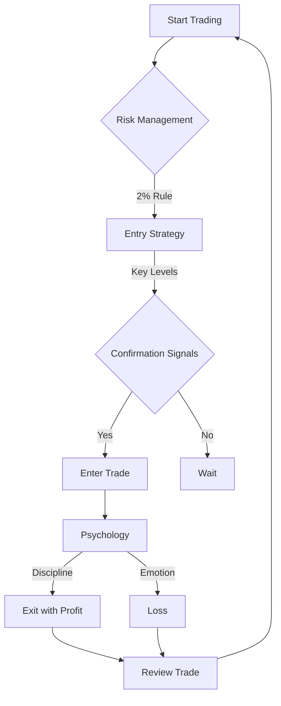

# Flowchart Diagram

```mermaid

graph TD
    A[Start Trading] --> B{Risk Management}
    B -->|2% Rule| C[Entry Strategy]
    C -->|Key Levels| D{Confirmation Signals}
    D -->|Yes| E[Enter Trade]
    D -->|No| F[Wait]
    E --> G[Psychology]
    G -->|Discipline| H[Exit with Profit]
    G -->|Emotion| I[Loss]
    H --> J[Review Trade]
    I --> J
    J --> A
    
```
