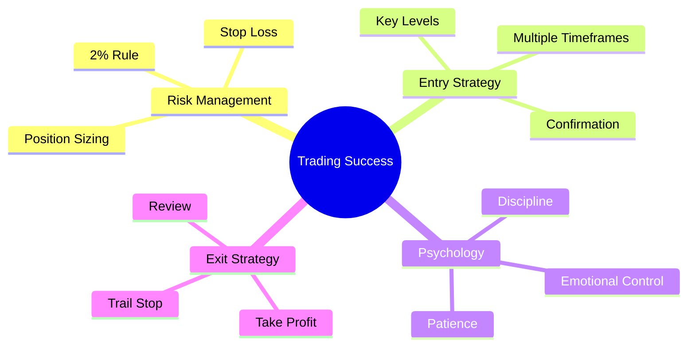

# Mindmap Diagram

```mermaid

mindmap
  root((Trading Success))
    Risk Management
      2% Rule
      Stop Loss
      Position Sizing
    Entry Strategy
      Key Levels
      Confirmation
      Multiple Timeframes
    Psychology
      Discipline
      Patience
      Emotional Control
    Exit Strategy
      Take Profit
      Trail Stop
      Review
    
```
